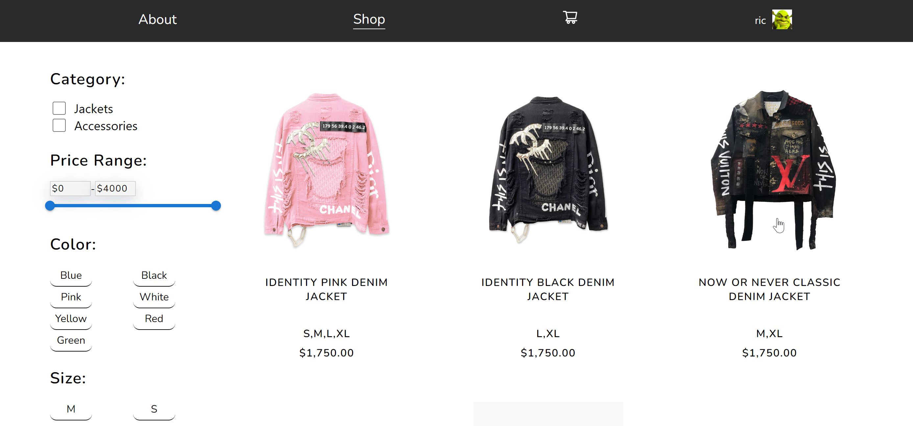
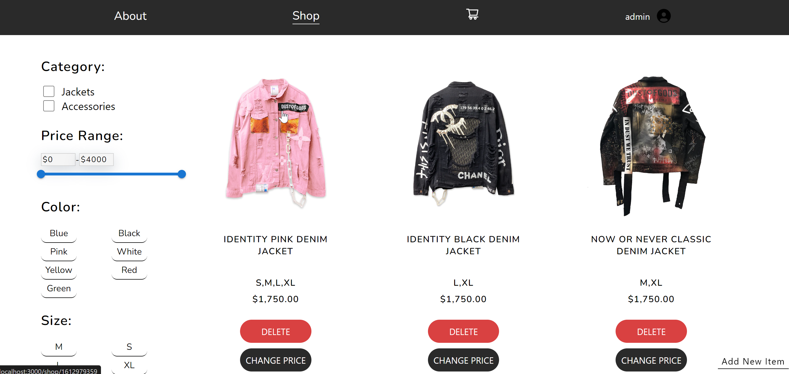
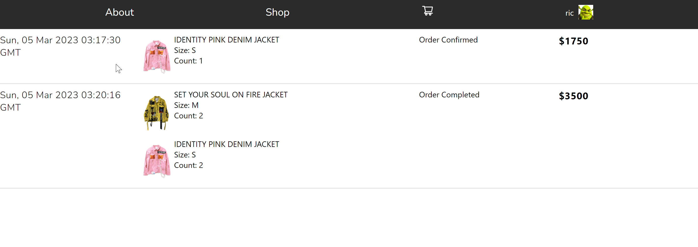
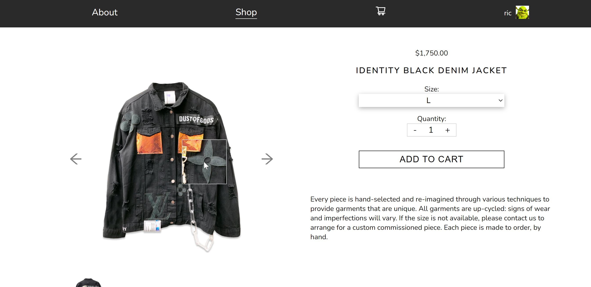

# Online Shop
1. Main Page

2. Admin

3. History

4. SingleItem

## Technologies

- Frontend: React.js, TypeScript, JavaScript, HTML, CSS, RTK, RTK-Query, JSON-Server, sass.

## Project Setup

1. Clone the repository to your local machine.
2. Install dependencies using the command `npm install`.
3. Start the project using the command `npm run dev`.
4. Open the application in a web browser at [http://localhost:3000](http://localhost:3000).

